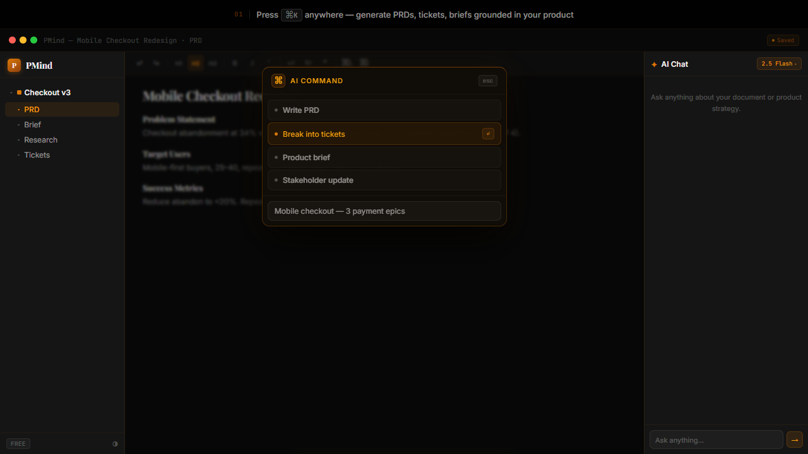
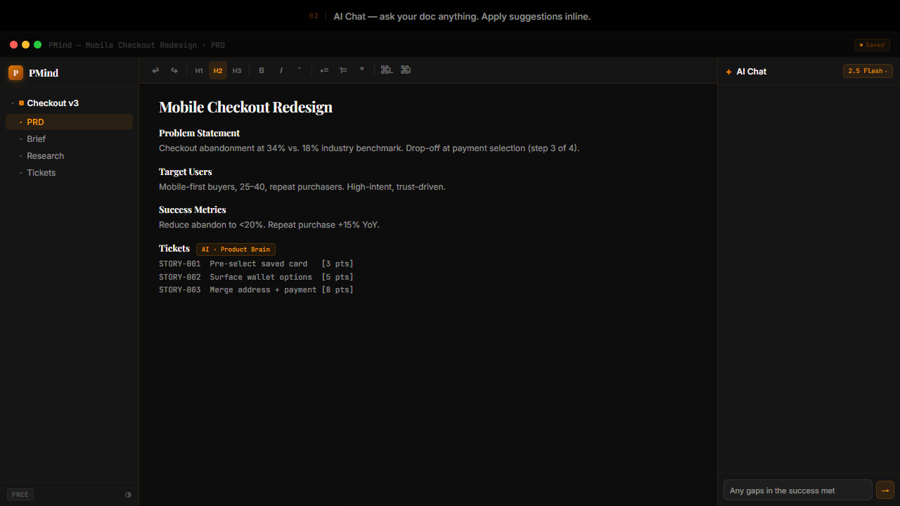
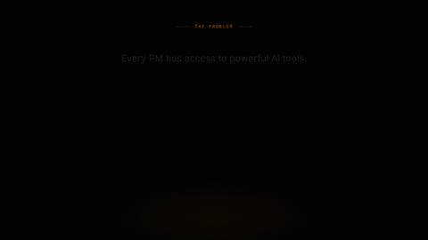

# PMind

**PMind turns messy customer feedback into a ranked, evidence-backed backlog — automatically.**

Most "AI for PMs" tools are a chat box that writes a nicer first draft. PMind's actual edge is upstream of that: a background multi-agent pipeline that reads your raw research (interviews, support tickets, NPS dumps) and turns it into severity-tagged insights, clusters them into themes, and scores opportunities with RICE — all cited back to the original customer quotes. The doc editor with `Cmd+K` is what you use *after* you already know what to build.

## The Discovery Engine

```
 1. Ingest                2. Extract insights            3. Rank opportunities         4. Ship
 ─────────────            ────────────────────           ───────────────────           ──────────────
 Interview transcripts    Background agents pull          Opportunity agent clusters    Commit an
 Support tickets          verbatim pain-point quotes,     insights across themes,       opportunity →
 NPS / CSV exports   ──▶  tag persona + sentiment,   ──▶  scores Reach/Impact/          break into
                          assign severity 1–5,             Confidence/Effort, and       epics + tickets
                          sort into theme folders          ranks by RICE score          → sync to
                                                                                          Jira/Linear
```

- **Automated insight extraction** — drop in interview transcripts or support exports; background agents harvest verbatim quotes, tag the persona and sentiment, and assign a severity score, no manual tagging.
- **Theme clustering** — insights are grouped into reusable theme folders so you can see what customers are actually complaining about in aggregate, not one interview at a time.
- **RICE-scored opportunities** — the Opportunity agent clusters insights across themes into proposed opportunities, each scored on Reach/Impact/Confidence/Effort and traceable back to the exact quotes behind it.
- **Decision ledger + outcome capture** — every shortlist/commit/discard decision is recorded, and shipped features get revisited later against real outcomes, so the system learns which calls actually worked.
- **Multi-agent handoffs** — PM, Analyst, Designer, Opportunity, Calendar, and Whiteboard agents hand off to each other and synthesize findings, so asks like *"synthesize my interviews, pull the perf numbers, tell me what to do"* happen in one turn instead of five tools.

## The editor (Cmd+K)

Once you know what to build, PMind also gives you an AI-native document editor: press `Cmd+K` anywhere to generate PRDs, ticket breakdowns, briefs, or stakeholder updates, grounded in a **Product Brain** (your product strategy/context, injected into every AI call) instead of generic templates.

| Cmd+K command picker | AI streaming into the doc | Result applied inline |
|---|---|---|
|  |  |  |

<details>
<summary>▶️ Watch the demo GIF</summary>



</details>

## Everything else

- **AI Chat sidebar** — threaded, persisted chat with model picker and RAG over your knowledge base.
- **Knowledge base (RAG)** — research docs and interview notes are chunked, embedded (pgvector), and retrieved during chat, search, and discovery ingestion.
- **Ticket export** — generate structured tickets and push them to **Jira** or **Linear**.
- **Projects & file tree** — organize docs in folders per project, with debounced auto-save and global semantic + text search.
- **Pluggable LLM providers** — Gemini (default), Anthropic Claude, or OpenAI. Switch with a single env var; users can also override the model per request from the UI.
- **Templates, theming, billing** — PM document templates, light/dark mode, and optional Stripe subscription management.

## Architecture

```
pm_cursor/
├── cursor-for-pms/          # Next.js 15 frontend (port 3000)
│   └── src/
│       ├── app/             # App Router pages (projects, editor, billing, blog…)
│       ├── components/      # Editor, AICommandModal, CursorChat, Sidebar, …
│       └── store/           # Zustand stores (Product Brain, active project, editor)
├── backend/                 # FastAPI backend (port 8000)
│   ├── main.py              # App entry, CORS, router mounts
│   ├── prompts.py           # System prompt templates per command
│   ├── llm/                 # Provider abstraction (Gemini / Claude / OpenAI)
│   ├── agent/               # Multi-agent orchestrator, tools, specialist agents
│   ├── routers/             # ai, projects, documents, knowledge, integrations, billing, …
│   └── migrations/          # Discovery + longitudinal-memory SQL
├── supabase_*.sql           # Core schema migrations (run in Supabase SQL editor)
├── landing/                 # Static marketing page
└── testing/                 # Fictional sample interviews to try research synthesis
```

| Layer | Choice |
|---|---|
| Frontend | Next.js 15 (App Router, TypeScript, React 19) |
| Editor | Tiptap (ProseMirror) |
| Styling | Tailwind CSS + shadcn/ui primitives |
| Auth | Clerk |
| Client state | Zustand |
| Backend | FastAPI + Uvicorn |
| LLM | Pluggable — Gemini (default), Claude, OpenAI, streamed over SSE |
| Database | Supabase (PostgreSQL + pgvector) |
| Integrations | Jira, Linear, Stripe (optional) |

All AI traffic flows through the FastAPI backend (`/ai/*`), which builds the system prompt from the command template + Product Brain context and streams the provider response back as Server-Sent Events.

## Getting started

### Prerequisites

- Node.js 18+
- Python 3.10+
- A [Supabase](https://supabase.com/) project (database)
- A [Clerk](https://clerk.com/) application (auth)
- An API key for at least one LLM provider: [Gemini](https://ai.google.dev/), [Anthropic](https://console.anthropic.com/), or [OpenAI](https://platform.openai.com/)

### 1. Database

Run the SQL migrations in your Supabase SQL editor, in order:

```
supabase_schema.sql
supabase_phase0.sql
supabase_phase1_filetree.sql
supabase_phase2_chat.sql
supabase_phase2_rag.sql
supabase_phase2b_storage.sql
supabase_phase3_integrations.sql
supabase_phase4_billing.sql
supabase_phase4_search.sql
backend/migrations/document_chunks.sql
backend/migrations/discovery.sql
backend/migrations/tier1_longitudinal.sql
backend/migrations/tier2_decision_ledger.sql
backend/migrations/tier3_outcome_capture.sql
```

### 2. Backend

```bash
cd backend
python -m venv venv
venv\Scripts\activate          # Windows
# source venv/bin/activate     # macOS/Linux
pip install -r requirements.txt

cp .env.example .env           # then fill in your keys
uvicorn main:app --reload --port 8000
```

Switching LLM providers is just env vars — no code changes:

```env
LLM_PROVIDER=gemini    LLM_MODEL=gemini-2.5-flash     GOOGLE_API_KEY=...
LLM_PROVIDER=claude    LLM_MODEL=claude-sonnet-4-6    ANTHROPIC_API_KEY=...
LLM_PROVIDER=openai    LLM_MODEL=gpt-4o               OPENAI_API_KEY=...
```

### 3. Frontend

```bash
cd cursor-for-pms
npm install
cp .env.local.example .env.local   # then fill in your keys
npm run dev
```

Open [http://localhost:3000](http://localhost:3000), sign in, create a project, and press `Cmd+K` (or `Ctrl+K`).

### Try it with sample data

The `testing/` folder contains five fictional user interviews and research notes for a made-up product ("Shopflow"). Upload them as knowledge documents and open a project's **Discovery** tab to watch the full pipeline run: insight extraction with severity/persona tags → theme clustering → RICE-ranked opportunities. You can also paste one into a doc and run the **interview synthesis** Cmd+K command for a lighter-weight, single-doc version of the same idea.

## Environment variables

Secrets live only in `backend/.env` and `cursor-for-pms/.env.local` — both are gitignored. Use the committed example files as templates:

- [`backend/.env.example`](backend/.env.example) — LLM provider keys, Supabase URL + **service** key, Clerk secret key
- [`cursor-for-pms/.env.local.example`](cursor-for-pms/.env.local.example) — Supabase URL + anon key, Clerk publishable/secret keys, backend URL

Never commit real keys. The Supabase service key bypasses RLS and must stay server-side.

## Contributing

Issues and pull requests are welcome. Useful maps of the codebase:

- [`CODEBASE_CONTEXT.md`](CODEBASE_CONTEXT.md) — file-by-file reference of the whole repo
- [`DESIGN.md`](DESIGN.md) — the UI design system
- [`backend/agent/PLANS.md`](backend/agent/PLANS.md) — the multi-agent orchestration roadmap

Before opening a PR, run `npm run typecheck && npm run lint` in `cursor-for-pms/` and `pytest` in `backend/`.

## License

[MIT](LICENSE) © 2026 Adamya Vashisth
